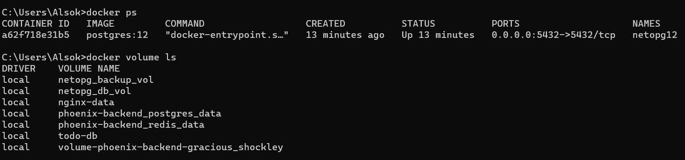
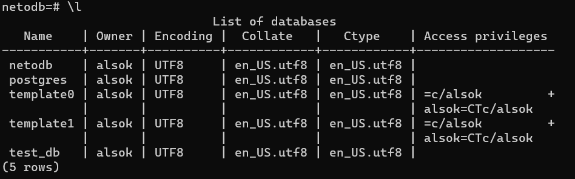
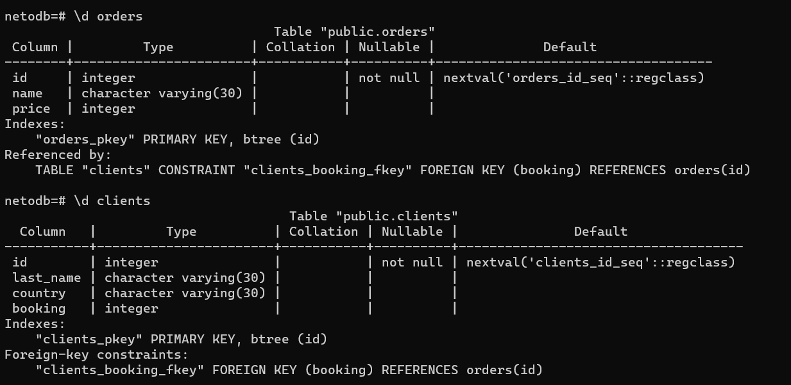
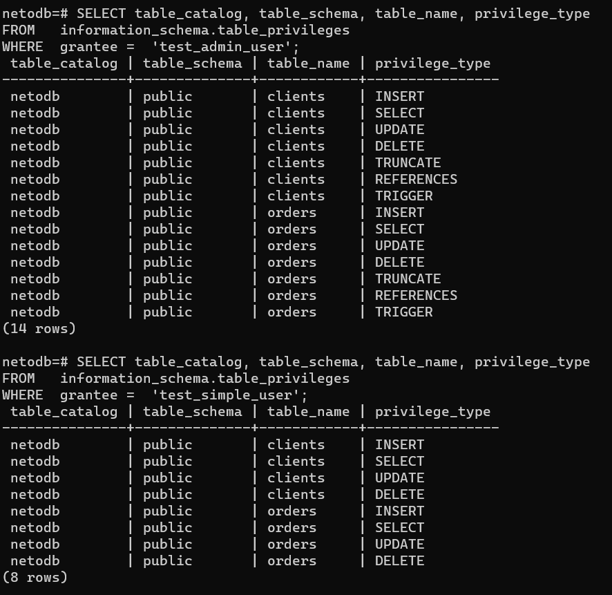
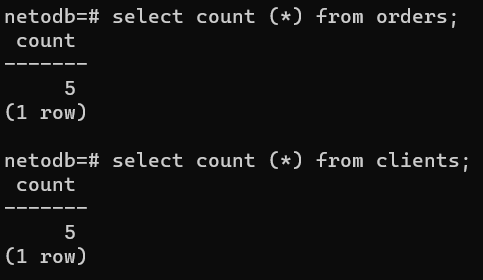
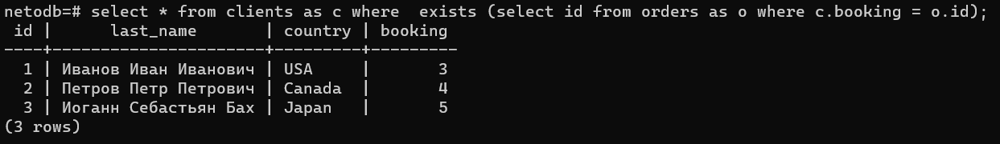
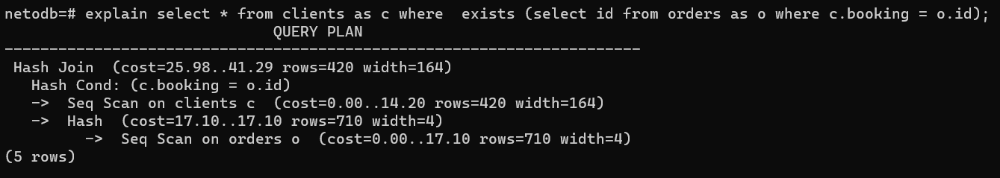
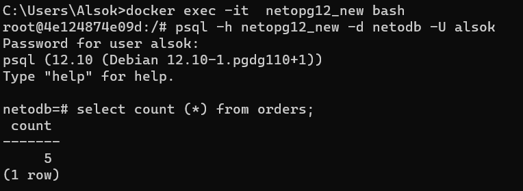
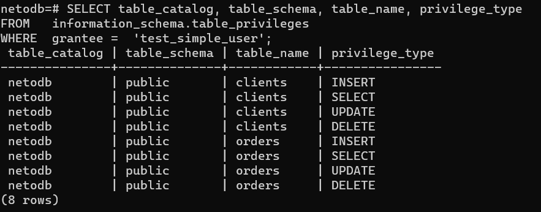

# Домашнее задание к занятию "6.2. SQL"

## Введение

Перед выполнением задания вы можете ознакомиться с 
[дополнительными материалами](https://github.com/netology-code/virt-homeworks/tree/master/additional/README.md).

## Задача 1

Используя docker поднимите инстанс PostgreSQL (версию 12) c 2 volume, 
в который будут складываться данные БД и бэкапы.

Приведите получившуюся команду или docker-compose манифест.
>```docker pull postgres:12```   _(было скачано заранее)_     
> файл [docker-compose.yml](./netopg/netolpg_old/docker-compose.yml)    
> запуск команды:    
> ```docker-compose up -d```     
> запускает инстанс PostgreSQL (версию 12) и создает тома netopg_backup_vol и netopg_db_vol
>     

## Задача 2

В БД из задачи 1: 
- создайте пользователя test-admin-user и БД test_db
> CREATE USER test_admin_user;    
CREATE DATABASE test_db;

- в БД test_db создайте таблицу orders и clients (спeцификация таблиц ниже)
>create table orders (id serial primary key, Name character varying(30), Price integer);    
create table clients (id serial primary key, Last_name character varying(30), Country character varying(30), Booking integer, FOREIGN KEY (Booking) REFERENCES orders (id));

- предоставьте привилегии на все операции пользователю test-admin-user на таблицы БД test_db
> GRANT ALL PRIVILEGES ON orders TO test_admin_user;    
> GRANT ALL PRIVILEGES ON clients TO test_admin_user;    
- создайте пользователя test-simple-user  
> CREATE USER test_simple_user;
- предоставьте пользователю test-simple-user права на SELECT/INSERT/UPDATE/DELETE данных таблиц БД test_db
> GRANT SELECT ON TABLE clients TO test_simple_user;     
GRANT INSERT ON TABLE clients TO test_simple_user;     
GRANT UPDATE ON TABLE clients TO test_simple_user;     
GRANT DELETE ON TABLE clients TO test_simple_user;     
GRANT SELECT ON TABLE orders TO test_simple_user;     
GRANT INSERT ON TABLE orders TO test_simple_user;     
GRANT UPDATE ON TABLE orders TO test_simple_user;     
GRANT DELETE ON TABLE orders TO test_simple_user;     

Таблица orders:
- id (serial primary key)
- наименование (string)
- цена (integer)

Таблица clients:
- id (serial primary key)
- фамилия (string)
- страна проживания (string, index)
- заказ (foreign key orders)

Приведите:
- итоговый список БД после выполнения пунктов выше,

- описание таблиц (describe)

- SQL-запрос для выдачи списка пользователей с правами над таблицами test_db
> SELECT * FROM pg_shadow;      
 
> SELECT table_catalog, table_schema, table_name, privilege_type
FROM   information_schema.table_privileges 
WHERE  grantee =  'test_admin_user';     

> SELECT table_catalog, table_schema, table_name, privilege_type
FROM   information_schema.table_privileges 
WHERE  grantee =  'test_simple_user';       

- список пользователей с правами над таблицами test_db


## Задача 3

Используя SQL синтаксис - наполните таблицы следующими тестовыми данными:

Таблица orders

| Наименование | цена |
| ------------ | ---- |
| Шоколад      | 10   |
| Принтер      | 3000 |
| Книга        | 500  |
| Монитор      | 7000 |
| Гитара       | 4000 |

Таблица clients

| ФИО                  | Страна проживания |
| -------------------- | ----------------- |
| Иванов Иван Иванович | USA               |
| Петров Петр Петрович | Canada            |
| Иоганн Себастьян Бах | Japan             |
| Ронни Джеймс Дио     | Russia            |
| Ritchie Blackmore    | Russia            |
> insert into orders VALUES (1, 'Шоколад', 10), (2, 'Принтер', 3000), (3, 'Книга', 500), (4, 'Монитор', 7000), (5, 'Гитара', 4000);     
> 
> insert into clients VALUES (1, 'Иванов Иван Иванович', 'USA'), (2, 'Петров Петр Петрович', 'Canada'), (3, 'Иоганн Себастьян Бах', 'Japan'), (4, 'Ронни Джеймс Дио', 'Russia'), (5, 'Ritchie Blackmore', 'Russia');     

Используя SQL синтаксис:
- вычислите количество записей для каждой таблицы 
- приведите в ответе:
    - запросы
    - >select count (*) from orders;    
    - >select count (*) from clients;
    - результаты их выполнения

## Задача 4

Часть пользователей из таблицы clients решили оформить заказы из таблицы orders.

Используя foreign keys свяжите записи из таблиц, согласно таблице:

| ФИО                  | Заказ   |
| -------------------- | ------- |
| Иванов Иван Иванович | Книга   |
| Петров Петр Петрович | Монитор |
| Иоганн Себастьян Бах | Гитара  |

Приведите SQL-запросы для выполнения данных операций.
>update  clients set booking = 3 where id = 1;     
update  clients set booking = 4 where id = 2;     
update  clients set booking = 5 where id = 3;     

Приведите SQL-запрос для выдачи всех пользователей, которые совершили заказ, а также вывод данного запроса.
 
Подсказка - используйте директиву `UPDATE`.

> select * from clients as c where  exists (select id from orders as o where c.booking = o.id);



## Задача 5

Получите полную информацию по выполнению запроса выдачи всех пользователей из задачи 4 
(используя директиву EXPLAIN).
> explain select * from clients as c where  exists (select id from orders as o where c.booking = o.id);     
Приведите получившийся результат и объясните что значат полученные значения.

>планировщик выбирает соединение по хешу, при котором строки одной таблицы записываются в хеш-таблицу в памяти, после чего сканируется другая таблица и для каждой её строки проверяется соответствие по хеш-таблице.

## Задача 6

Создайте бэкап БД test_db и поместите его в volume, предназначенный для бэкапов (см. Задачу 1).

Остановите контейнер с PostgreSQL (но не удаляйте volumes).

Поднимите новый пустой контейнер с PostgreSQL.

Восстановите БД test_db в новом контейнере.

Приведите список операций, который вы применяли для бэкапа данных и восстановления. 


> Создадим и запустим новый инстанс PostgreSQL, с именем ```netopg12_new```   
> Новый файл [docker-compose.yml](./netolpg_new/docker-compose.yml)     
> Посмотрим, видит ли этот новый инстанс наши наработки. Выполним, например,    
> ```select count (*) from orders;```    
> Если в таблице что-то есть, то все ОК.
> 
> Посмотрим на "'test_simple_user" - тоже все на месте:
> 
---

### Как cдавать задание

Выполненное домашнее задание пришлите ссылкой на .md-файл в вашем репозитории.

---
