# Домашнее задание к занятию "6.4. PostgreSQL"

## Задача 1

Используя docker поднимите инстанс PostgreSQL (версию 13). Данные БД сохраните в volume.

> Файл [docker-compose.yml](./neto6db4/docker-compose.yml)  

Подключитесь к БД PostgreSQL используя `psql`.

Воспользуйтесь командой `\?` для вывода подсказки по имеющимся в `psql` управляющим командам.

**Найдите и приведите** управляющие команды для:
- вывода списка БД
> 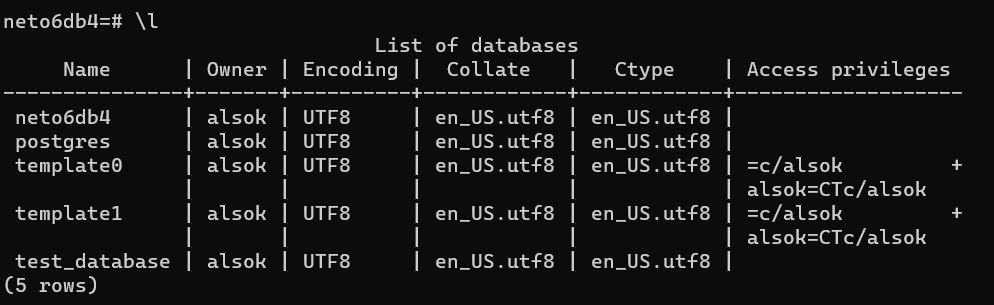
- подключения к БД
> 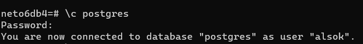
- вывода списка таблиц
> 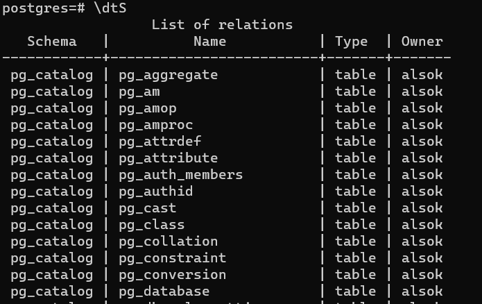
- вывода описания содержимого таблиц
> 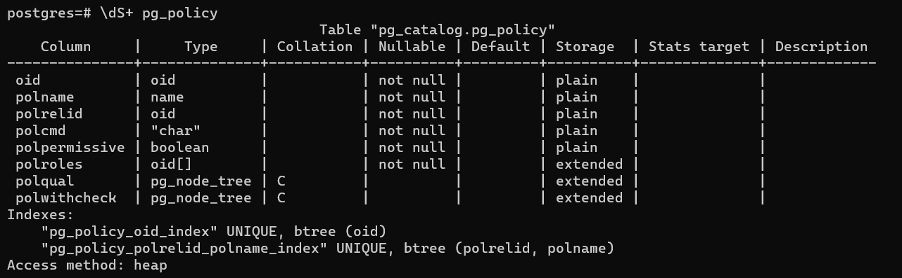
- выхода из psql
> 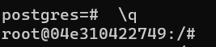

## Задача 2

Используя `psql` создайте БД `test_database`.
> 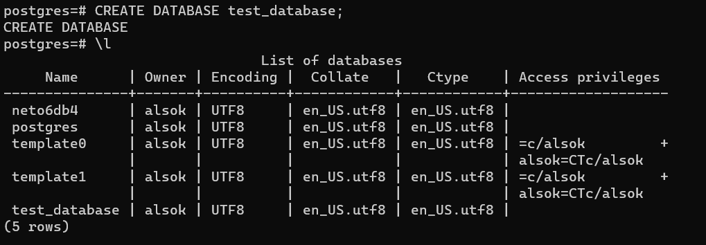
Изучите [бэкап БД](https://github.com/netology-code/virt-homeworks/tree/master/06-db-04-postgresql/test_data).

Восстановите бэкап БД в `test_database`.

> 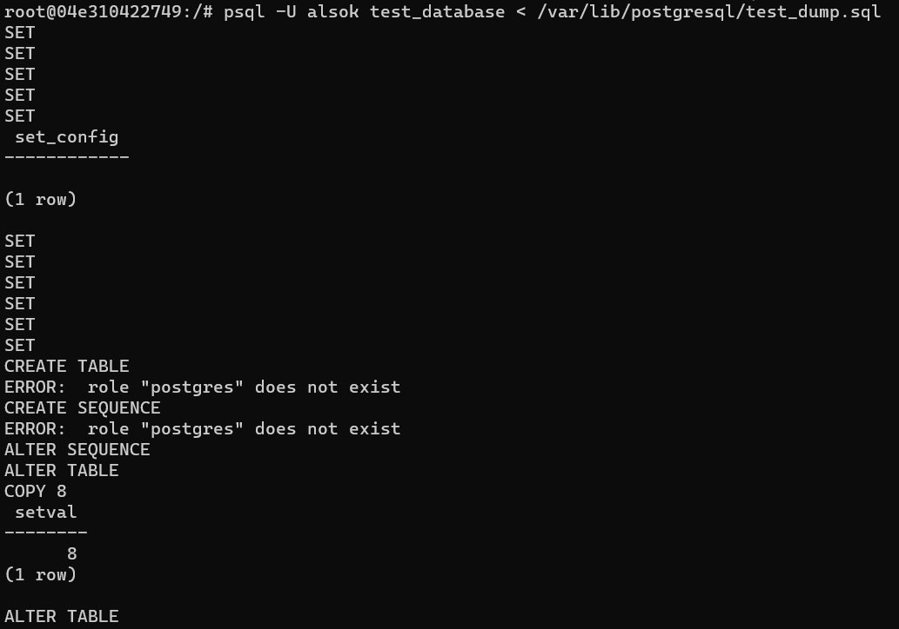

Перейдите в управляющую консоль `psql` внутри контейнера.

Подключитесь к восстановленной БД и проведите операцию ANALYZE для сбора статистики по таблице.

Используя таблицу [pg_stats](https://postgrespro.ru/docs/postgresql/12/view-pg-stats), найдите столбец таблицы `orders` 
с наибольшим средним значением размера элементов в байтах.

**Приведите в ответе** команду, которую вы использовали для вычисления и полученный результат.

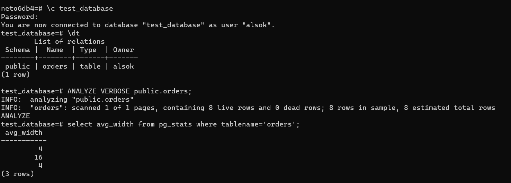

## Задача 3

Архитектор и администратор БД выяснили, что ваша таблица orders разрослась до невиданных размеров и
поиск по ней занимает долгое время. Вам, как успешному выпускнику курсов DevOps в нетологии предложили
провести разбиение таблицы на 2 (шардировать на orders_1 - price>499 и orders_2 - price<=499).

Предложите SQL-транзакцию для проведения данной операции.

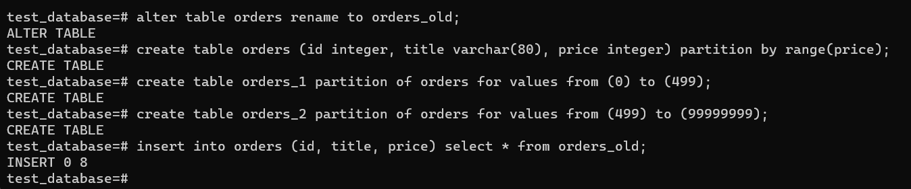

Можно ли было изначально исключить "ручное" разбиение при проектировании таблицы orders?
> Можно было заранее настроить таблицу `orders` в качестве секционированной.

## Задача 4

Используя утилиту `pg_dump` создайте бекап БД `test_database`.
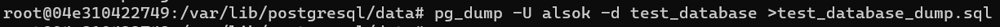
Как бы вы доработали бэкап-файл, чтобы добавить уникальность значения столбца `title` для таблиц `test_database`?

> Можно создать индекс:       
> `CREATE INDEX ON orders ((lower(title)));`

> Списал [отсюда](https://www.postgresql.org/docs/13/sql-createindex.html)
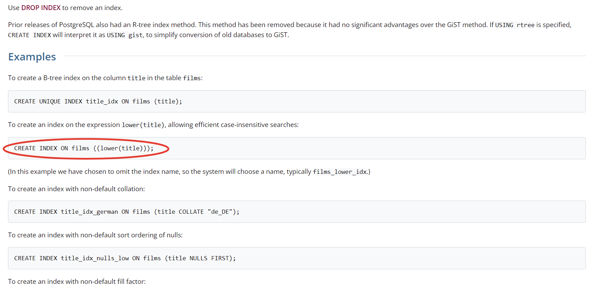
> Не знал, что нельзя пользоваться примерами из документации. Размеется, я понял далеко не все, и я бы использовал `CREATE UNIQUE INDEX`, как предлагается а первом примере, но стал читать об этом и [тут](https://www.postgresql.org/docs/13/indexes-unique.html) в Note сказано, что это не обязательно, поэтому я остановился на `CREATE INDEX ON`.
> И да, я пользуюсь и различными решебниками, и этот ответ фигурировал как верный, но я во всем страраюсь разобраться и не отправляю решение, пока не прогоню все через свой ноут и не добьсь, чтобы все работало как надо. Тупо списывать не вижу никакого смысла.

---

### Как cдавать задание

Выполненное домашнее задание пришлите ссылкой на .md-файл в вашем репозитории.

---
