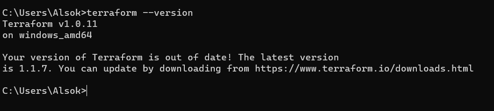

# Домашнее задание к занятию "7.1. Инфраструктура как код"

## Задача 1. Выбор инструментов. 
 
### Легенда
 
Через час совещание на котором менеджер расскажет о новом проекте. Начать работу над которым надо 
будет уже сегодня. 
На данный момент известно, что это будет сервис, который ваша компания будет предоставлять внешним заказчикам.
Первое время, скорее всего, будет один внешний клиент, со временем внешних клиентов станет больше.

Так же по разговорам в компании есть вероятность, что техническое задание еще не четкое, что приведет к большому
количеству небольших релизов, тестирований интеграций, откатов, доработок, то есть скучно не будет.  
   
Вам, как девопс инженеру, будет необходимо принять решение об инструментах для организации инфраструктуры.
На данный момент в вашей компании уже используются следующие инструменты: 
- остатки Сloud Formation, 
- некоторые образы сделаны при помощи Packer,
- год назад начали активно использовать Terraform, 
- разработчики привыкли использовать Docker, 
- уже есть большая база Kubernetes конфигураций, 
- для автоматизации процессов используется Teamcity, 
- также есть совсем немного Ansible скриптов, 
- и ряд bash скриптов для упрощения рутинных задач.  

Для этого в рамках совещания надо будет выяснить подробности о проекте, что бы в итоге определиться с инструментами:

1. Какой тип инфраструктуры будем использовать для этого проекта: изменяемый или не изменяемый?
> Поскольку ТЗ нечеткое и предстоит большое количество доработок и откатов, то предпочтительнее использовать изменяемый
тип инфраструктуры.
2. Будет ли центральный сервер для управления инфраструктурой?
> Мы не используем Chef, Puppet или SaltStack, поэтому можно обойтись без центрального сервера.
3. Будут ли агенты на серверах?
> По этой же причине агенты на серверах будут не нужны.
4. Будут ли использованы средства для управления конфигурацией или инициализации ресурсов?
> Да, будут нужны средства для управления конфигурацией (как минимум, для Ansible) и будут нужны средства для инициализации ресурсов (как минимум для Terraform).
 
В связи с тем, что проект стартует уже сегодня, в рамках совещания надо будет определиться со всеми этими вопросами.

### В результате задачи необходимо

1. Ответить на четыре вопроса представленных в разделе "Легенда". 
1. Какие инструменты из уже используемых вы хотели бы использовать для нового проекта?
>  Чтобы не "размазываться" я бы попробовал конфигурацию Docker+Packer+Terraform.> 
3. Хотите ли рассмотреть возможность внедрения новых инструментов для этого проекта? 
> Поскольку ТЗ нечеткое, трудно выбрать что-то новое. Имеющегося набора достаточно для решения практически любых задач, по по мере конкретизации задачи, возможно, потребуются какие-то специальные инструменты. 

Если для ответа на эти вопросы недостаточно информации, то напишите какие моменты уточните на совещании.

## Задача 2. Установка терраформ. 

Официальный сайт: https://www.terraform.io/

Установите терраформ при помощи менеджера пакетов используемого в вашей операционной системе.
В виде результата этой задачи приложите вывод команды `terraform --version`.
> 

## Задача 3. Поддержка легаси кода. 

В какой-то момент вы обновили терраформ до новой версии, например с 0.12 до 0.13. 
А код одного из проектов настолько устарел, что не может работать с версией 0.13. 
В связи с этим необходимо сделать так, чтобы вы могли одновременно использовать последнюю версию терраформа установленную при помощи
штатного менеджера пакетов и устаревшую версию 0.12. 

В виде результата этой задачи приложите вывод `--version` двух версий терраформа доступных на вашем компьютере 
или виртуальной машине.

> Версия работающего terraform последней на 11.03.2022 версии на скрине в задаче 2.     
> Установил старую версию 1.0.11 и изменил пути. После перезапуска командной строки видим, что запускается terraform именно нужной мне версии:
> 

---

### Как cдавать задание

Выполненное домашнее задание пришлите ссылкой на .md-файл в вашем репозитории.

---
