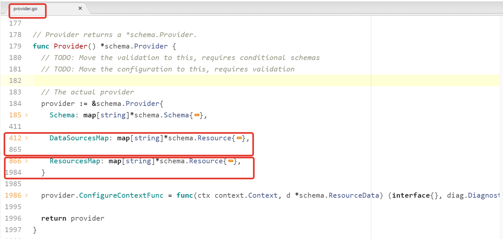

# Домашнее задание к занятию "7.6. Написание собственных провайдеров для Terraform."

Бывает, что 
* общедоступная документация по терраформ ресурсам не всегда достоверна,
* в документации не хватает каких-нибудь правил валидации или неточно описаны параметры,
* понадобиться использовать провайдер без официальной документации,
* может возникнуть необходимость написать свой провайдер для системы используемой в ваших проектах.   

## Задача 1. 
Давайте потренируемся читать исходный код AWS провайдера, который можно склонировать от сюда: 
[https://github.com/hashicorp/terraform-provider-aws.git](https://github.com/hashicorp/terraform-provider-aws.git).
Просто найдите нужные ресурсы в исходном коде и ответы на вопросы станут понятны.  


1. Найдите, где перечислены все доступные `resource` и `data_source`, приложите ссылку на эти строки в коде на 
гитхабе.   
> Все доступные `resource` и `data_source` нашлись на этой [странице](https://github.com/hashicorp/terraform-provider-aws/blob/main/internal/provider/provider.go), в строках 866-1983 и 412-864 соответственно, как видно, если свернуть строки в редакторе:
    


1. Для создания очереди сообщений SQS используется ресурс `aws_sqs_queue` у которого есть параметр `name`. 
    * С каким другим параметром конфликтует `name`? Приложите строчку кода, в которой это указано.
    * Какая максимальная длина имени? 
    * Какому регулярному выражению должно подчиняться имя?


> ПРОШУ УТОЧНИТЬ - САМОСТОЯТЕЛЬНО НЕ ПОЛУЧАЕТСЯ.    
> Где именно определяется ресурс `aws_sqs_queue` у которого есть параметр `name` найти не удалось. Поиск по ```resource "aws_sqs_queue"``` не обнаружил файлов c таким содержимым, только какие-то test и markdown.
> - в разных руководствах нашел, что `name` конфликтует с `name_prefix`. Но найти это в коде не получилось. Искал по разному, в том числе по вхождению `Conflicts with name` (с кавычками и без).
> - Из руководств выяснил, что максимальная длина имени 80, но где это в коде - не нашел.
> - Опять же из руководст выяснил, что "имена очередей должны состоять только из прописных и строчных букв ASCII, цифр, знаков подчеркивания и дефисов", но где это описано в коде в виде регулярки не нашел...    
>   Прошу помочь!
    
## Задача 2. (Не обязательно) 
В рамках вебинара и презентации мы разобрали как создать свой собственный провайдер на примере кофемашины. 
Также вот официальная документация о создании провайдера: 
[https://learn.hashicorp.com/collections/terraform/providers](https://learn.hashicorp.com/collections/terraform/providers).

1. Проделайте все шаги создания провайдера.
2. В виде результата приложение ссылку на исходный код.
3. Попробуйте скомпилировать провайдер, если получится то приложите снимок экрана с командой и результатом компиляции.   

---

### Как cдавать задание

Выполненное домашнее задание пришлите ссылкой на .md-файл в вашем репозитории.

---
